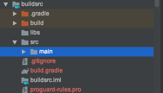
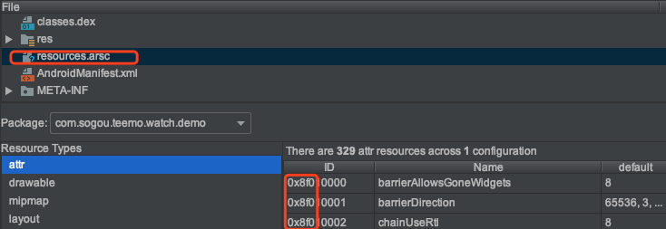

#### What is gradle plugin
作为 Android 的开发人员，只要使用过 AndroidStudio 的，想必对 app 目录下的 build.gradle 都不陌生，还记得 build.gradle 的第一行是什么吗？
```groovy
apply plugin: 'com.android.application'
```
这里就是引用了一个 gradle 的插件，只不过这个插件是 Google 写好的，我们直接引用就可以。  
插件无非也就是一些功能集合的封装，通过封装好的形式提供大家使用，方便快捷。

还记得 **手表 APP 瘦身记录** 中提到的修改资源的 packageId 和打包第三方公共 class 的方式吗？就是使用的自定义的 gradle plugin。

#### Write a sample plugin
1. 在现有的 Project 中新建一个 Module
    * 不管是 Phone&Tablet Module 或 Android Librarty 都可以
    * **`Module 的名字命名为 buildSrc`**
    * 只保留 src/main 和 build.gradle, 其他的都删除
    
    * 删除 build.gradle 中内容，替换为：
     ```groovy
        apply plugin: 'java'

        dependencies {
            compile gradleApi()
        }
     ```
     
2. 新建TestPlugin.java 文件，实现自定义插件的内容
    * 可以使用 java 、kotlin 或 groovy 语言
    * 我们使用熟悉的 java 语言
    ```java
    package com.sogou.teemo.watch.gradle;

    import org.gradle.api.Plugin;
    import org.gradle.api.Project;

    public class TestPlugin implements Plugin<Project> {
        @Override
        public void apply(Project project) {
            System.out.println("自定义插件=====");
        }
    }
    ```
3. 在主工程中引用
    * 打开 app/build.gradle 文件
    * 在熟悉的 `apply plugin: 'com.android.application'`下一行加上我们自定义的 plugin
    ```groovy
    apply plugin: 'com.android.application'

    apply plugin: com.sogou.teemo.watch.gradle.TestPlugin

    ```
4. build
    * 执行 gradle 的 build task，会看如下输出
    ```groovy
    > Task :buildSrc:testClasses UP-TO-DATE
    > Task :buildSrc:test NO-SOURCE
    > Task :buildSrc:check UP-TO-DATE
    > Task :buildSrc:build UP-TO-DATE

    > Configure project :app
    自定义插件=====

    > Task :app:preBuild UP-TO-DATE
    > Task :app:preDebugBuild UP-TO-DATE
    > Task :app:compileDebugAidl NO-SOURCE
    ```

#### Write Custom Plugin
1. 指定编译资源用的 aapt 路径，自定义资源的 packageId
```java
@Override
    public void apply(Project project) {
        System.out.println("自定义插件>>>>>");
        project.getPlugins().all( plugin -> {
            if (plugin instanceof AppPlugin) {
                System.out.println("app plugin");
                AppExtension appPlugin = project.getExtensions().getByType(AppExtension.class);
                //核心代码是这里，指定新的 aapt 的路径
                modifyAaptPathTask(project,appPlugin);
            }
        });
        System.out.println("自定义插件<<<<<");
    }
```
2. 通过命令行参数的方式给 aapt 设置新的 packageId
   *  android.getAaptOptions().additionalParameters("--PLUG-resoure-id","0x8f");
   * 通过反射修改路径
   ```java
   Field androidBuilderField =          BaseVariantImpl.class.getDeclaredField("androidBuilder");
                    androidBuilderField.setAccessible(true);
                    AndroidBuilder androidBuilder = (AndroidBuilder) androidBuilderField.get(variant);
                    BuildToolInfo buildToolInfo = androidBuilder.getTargetInfo().getBuildTools();
                    Method addMethod = BuildToolInfo.class.getDeclaredMethod("add",BuildToolInfo.PathId.class, File.class);
                    addMethod.setAccessible(true);
                    String osName = System.getProperty("os.name");
                    System.out.println("osName:"+osName);
                    String aaptName;
                    if (osName.contains("Mac OS")){
                        aaptName="aapt_mac";
                    }else {
                        aaptName="aapt_win";
                    }
                    addMethod.invoke(buildToolInfo,BuildToolInfo.PathId.AAPT,new File(project.getRootDir()+"/tools/",aaptName));
                    System.out.println("new aapt path:"+buildToolInfo.getPath(BuildToolInfo.PathId.AAPT));
   ```
   * 不启用 aapt2， 在 project 的根目录下的gradle.properties 中添加设置： 
   ```java
    android.enableAapt2=false
   ```
   * buildSrc目录下的 build.gradle要引用新的依赖  
   ```groovy
    apply plugin: 'java'

    allprojects {
        repositories {
            google()
            jcenter()
        }
    }

    dependencies {
        compile gradleApi()
        //不能使用过高的 gradle 版本，3.4.0 的版本就开始要求强制使用 aapt2
        compile 'com.android.tools.build:gradle:3.1.0'
    }
   ```
   * assembleRelease
   ```java
    > Configure project :app
    WARNING: The option 'android.enableAapt2' is deprecated and should not be used anymore.
    Use 'android.enableAapt2=true' to remove this warning.
    It will be removed at the end of 2018.
    自定义插件>>>>>
    app plugin
    name:debug
    osName:Mac OS X
    new aapt path:/Users/zhangjifeng/Documents/android/workspace/teemo/Demo/tools/aapt_mac
    name:release
    osName:Mac OS X
    new aapt path:/Users/zhangjifeng/Documents/android/workspace/teemo/Demo/tools/aapt_mac
    
    ....
    
    ***PLUG*** initPLUGConig 0x8f 
    ***PLUG*** PLUG Shared Resource pkgGroup 0x8f 
    
    ...
    
    BUILD SUCCESSFUL in 23s

   ```
   * 查看编译好的 apk 中的资源 id 确实是我们设置的 0x8f
   
   